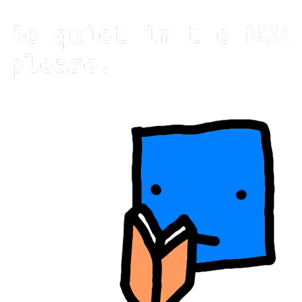

# Sector

> "Hello, I am your XPert, the NOK librarian. Though, you can call me PER, standing for Perceptional Exceptional Responder. If you have any questions, you can search in my query console. Keep quiet in the NOK, please. My nodes don't like it when the sound sensors get overloaded."

**Sector** is a Sci-Fi universe, you can read it [here](https://just-a-unity-dev.github.io/sector/).

## Notice

This website is essentially a fancy book, there will rarely (if ever) be an Out of Context (OOC) reference. Despite this, every single thing is documented from a neutral perspective.

## Origin

Originally came from a single Dungeons & Dragons campaign during winter break is now a whole universe with diplomacy and more to enjoy, the different sectors in the Quadrant are growing every day.

## Inspirations

This is a list of major inspirations for the sector universe.

- [FTL: Faster Than Light](https://store.steampowered.com/app/212680/FTL_Faster_Than_Light/)
- [Into The Breach](https://store.steampowered.com/app/590380/Into_the_Breach)
- [Starsector](https://fractalsoftworks.com/)
- [Star Trek: The Original Series](https://en.wikipedia.org/wiki/Star_Trek:_The_Original_Series)
- [Firefly](https://en.wikipedia.org/wiki/Firefly_(TV_series))
- [Rimworld](https://store.steampowered.com/app/294100/RimWorld/)
- Space Folk Songs (Leslie Fish, Julia Ecklar, Vic Tyler)
